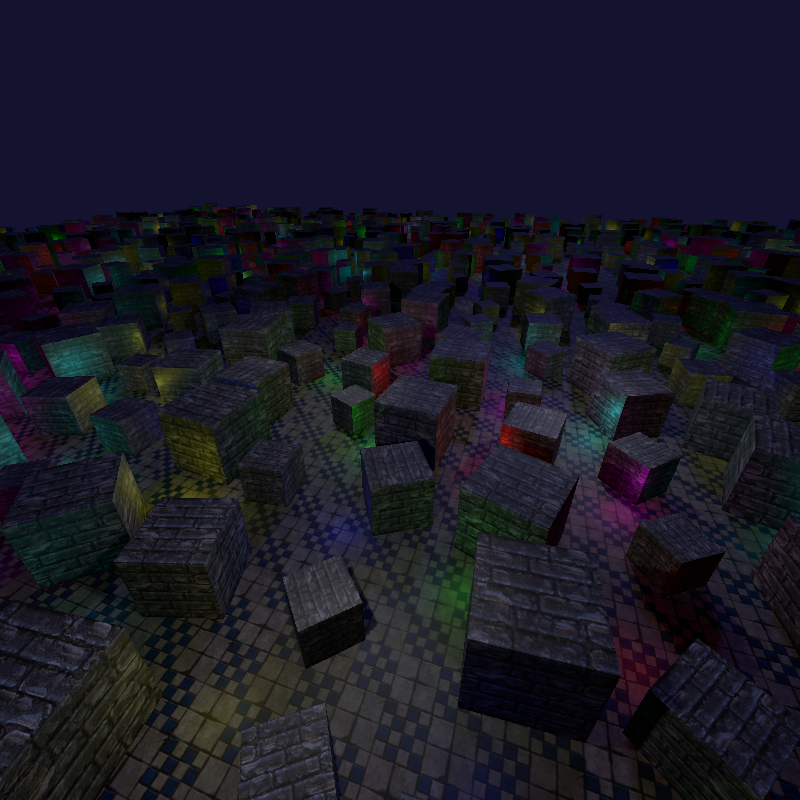
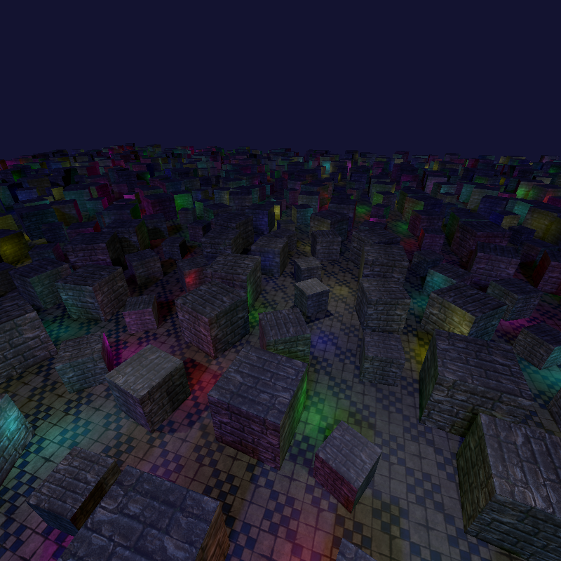

# Deferred render example

This example shows basics of deferred render path construction using `universe_render_foundation` unit features: it 
renders simple scene with simple lighting with light impact culling using screen quad reprojection in vertex shader.
It makes it easy to render 961 point light without shadows (there is also 1 directional light with shadows and 3 point 
lights with shadow to show that shadow mapping works) on two viewports. To make this example simple, we do not use 
any culling and do not use shadow map atlases: it would make this already big example overly complex.
